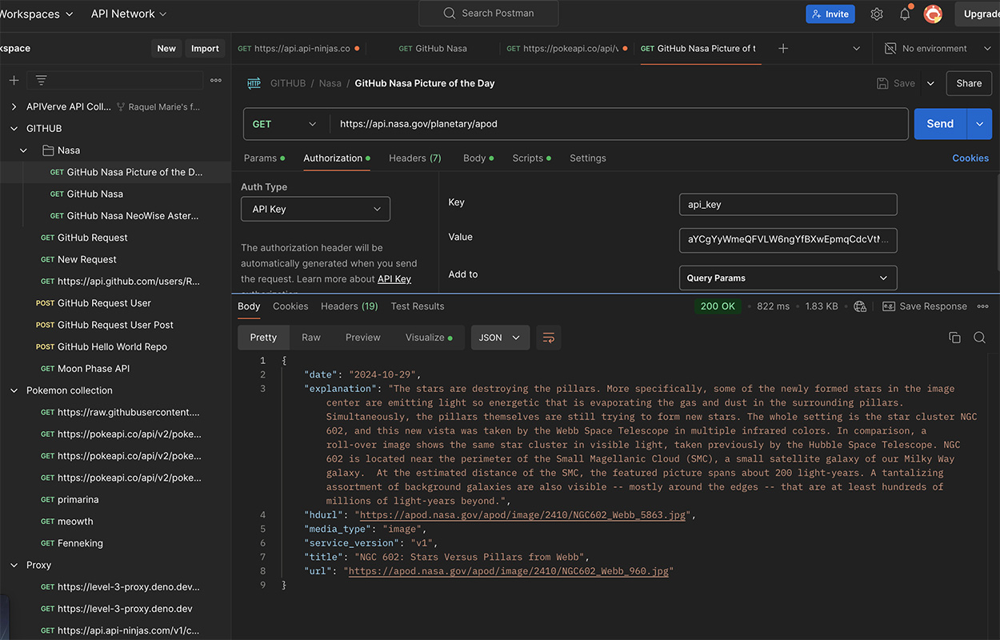
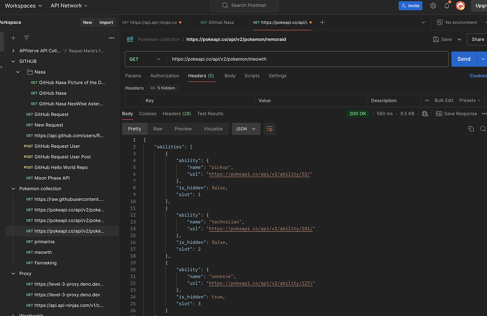

## Roadmap

- [x] Create new branch => week-5
- [x] Write a Proxy Server for Cats Data = api/cats.js
- [x] In /api folder, create 3 new endpoints
- [x] -/api/pokemon to fetch data from Pokemon Api
- [x] -api/cats to fetch data from cat Api
- [x] Use Postman to send requests to api/pokemon , api/nasa & api/cats
- [x] BONUS TASK: use another API that requires an Api Key *nasa api*
- [x] Create a README.md
- [x] Include screenshots of the Postman requests for the APIs that use Postman authorization  (`/api/pokemon` & `/api/nasa`)
- [ ] Add the link to your deployed project (e.g., `https://your-project-name.vercel.app`).

 
 

  

  

##Project Overview**: This project demonstrates my ability to fetch data using async functions that retrieve API data through an API route via an API url with an api-key that makes it possible to get a response for my secure data request. 

##Setup Instructions**: To run it locally, I enter **npm run dev** in the terminal and make sure that the endpoint connects to the local server. EX: http://localhost:3000/api/nasa 

##Endpoints**: ` http://localhost:3000/api/nasa` (nasa apod api image data), `http://localhost:3000/api/pokemon` =(pokemon api character data)= `http://localhost:3000/api/pokemon2` & `http://localhost:3000/api/cats` (cat breed api data). 

